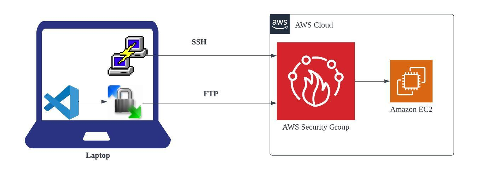

### Shell Scripting

Register For course: [Shell Scripting Course](https://bit.ly/shell-siva)

If you were given a task, instead of running multiple commands to complete the task manually, you can simply put those commands in a file and run it as a script that does the task without human errors.

### ENV SetUp
##### Pre-Requisites

* AWS Account
* Putty
* WinScp
* IDE (NotePad++/VS Code)

### **Steps:**

* Create one security group on default VPC.
* Launch EC2, we use centos 8
* Connect through putty, WinScp
* Setup NotePad++ or VS Code as IDE in WinScp.

### Coding
Coding is 2 types.
* **Programming**  
    Programming can be done by developers. Usually it has complex coding like data base transactions, session management, triggering communications, etc. Developers should write code in an effective way that should consume less memory and less time more speed.
* **Scripting**  
    Scripting is done by generally system admins, DevOps, Cloud, Database admins, developers, etc. Scripting is usually automating manual tasks like
    * Deleting old files
    * Installing packages
    * Configuring servers
    * Adding or removing users

#### Coding Concepts
Usually coding have universal concepts.
* Variables
* Data types
* Conditions
* Functions
* Loops

